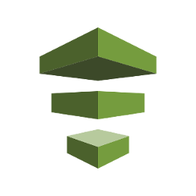
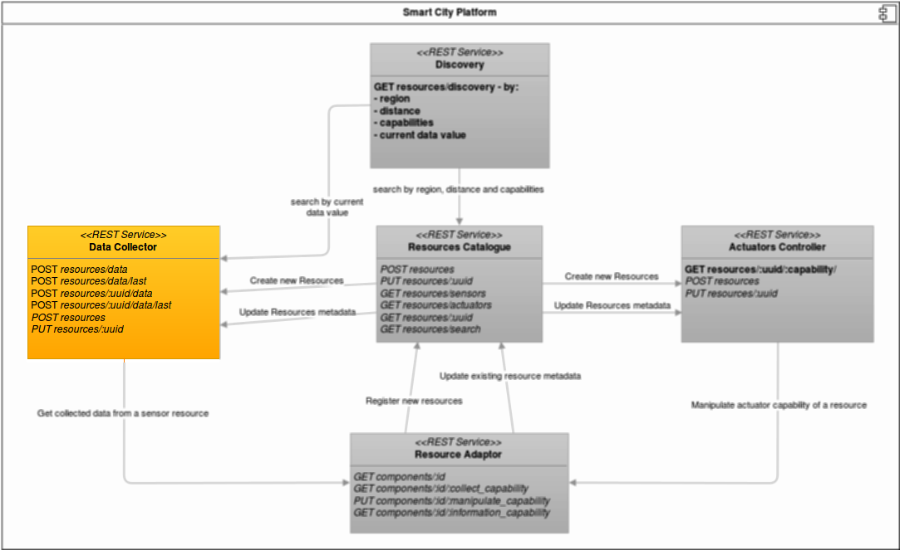

 

<h1 align="center"> Smart City Platform - Data Collector</h1>

---

# Welcome to Data Collector

> The *Data Collector*'s main goal is to provide methods to search data collected
from *Resources*.

> This service is used both by applications and the Catalog Service, and offers
developers access to information coming from different sensors scattered
throughout the city. For example, with this service one could obtain data of
all temperature sensors on USP.

# Architecture

# How to use

> We developed a [step-by-step](https://gitlab.com/smart-city-platform/data_collector/wikis/basic-setup) to configure the application.
After configure the application, it should be possible to request data and filter it by some parameters.

> We developed a [manual](https://social.stoa.usp.br/poo2016/projeto/group-3-data-collector) to understand our API.In this manual can be found a data structure used to return the data and some usage examples.

> We developed a [pub/sub](https://gitlab.com/smart-city-platform/data_collector/wikis/pub-sub) system,to be possible receive a notification every time that a new data is collected.

# Setup and references

> If you need help, look at:

> * [Basic setup](https://gitlab.com/smart-city-platform/data_collector/wikis/basic-setup)
> * [Publish/Subscribe](https://gitlab.com/smart-city-platform/data_collector/wikis/pub-sub)
> * [Our API](https://social.stoa.usp.br/poo2016/projeto/group-3-data-collector)
> * [Base architecture overview](http://s32.postimg.org/a16hueg79/Arquitetura_geral_da_plataforma_de_cidades_intel.jpg)
> * Data Collector's [Class Diagram](documentation/ClassDiagram.png)

# Docker setup

* Install Docker and docker-compose (versão 1.6+): (google it)
* Run on terminal:
  * `$ docker-compose build`
  * `$ docker-compose run website bundle exec rake db:create`
  * `$ docker-compose run website bundle exec rake db:migrate`
  * **(OPTIONAL):** `$ docker-compose run website bundle exec rake db:seed`
  * `$ `docker-compose up`

Now you can access the application on http://localhost:4000
